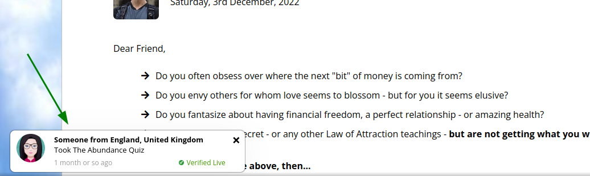
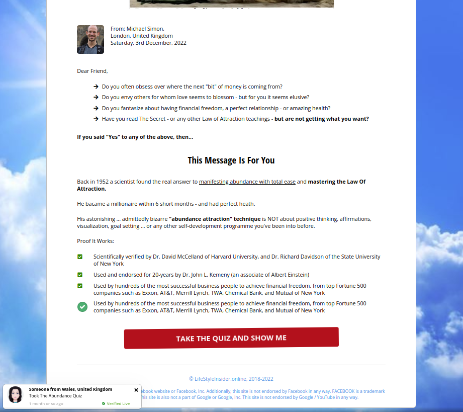
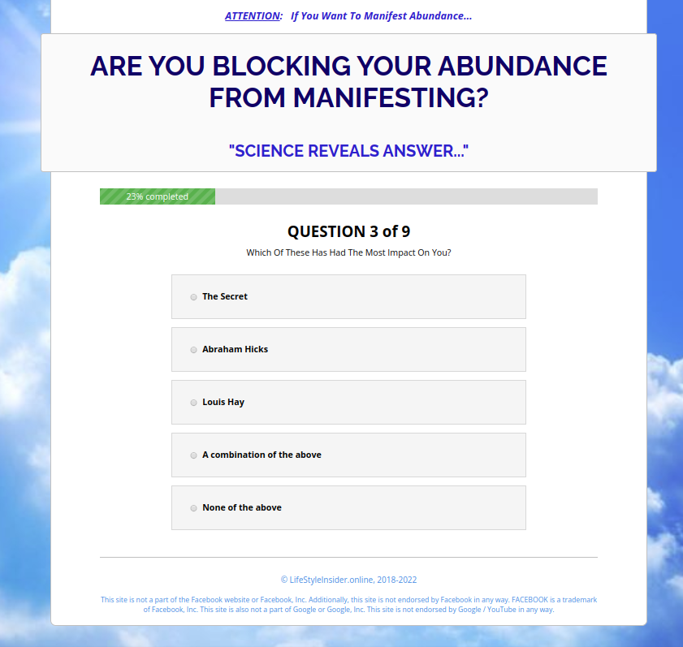
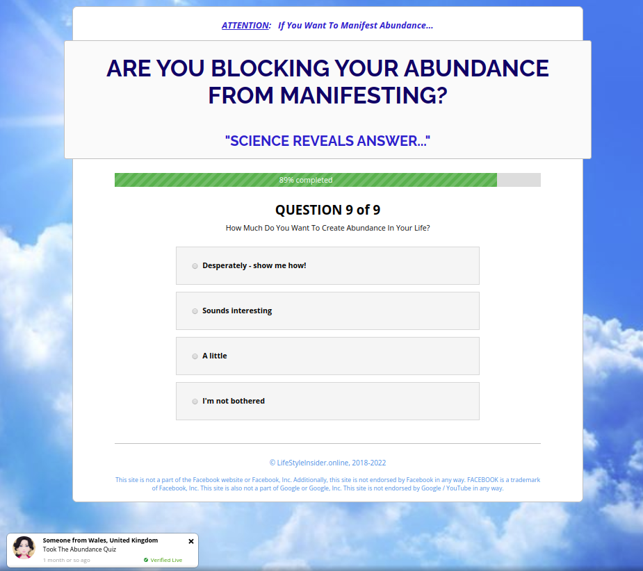

# ReadMe:

This was a project for a landing page for an online marketer. It was designed to pre-sell a self-help product, to increase desire in prospects who came from a Facebook Advert.

Online quizes are well known to increase conversion rate when making purchasing decisions. 

This was a custom built Javascript/Jquery quiz, with online tracking built in. Short loading time was of the essence in the project brief.
 

# Features:

- Fully mobile responsive
- Hand coded in PHP, CSS and JS (so it is fast loading, faster than most prebuilt *bloated* web site template builders)
- When live it was hosted on a Google Compute Engine Ubuntu instance - for *lightening fast* scalable up-time
- Built in CSS and JS compressor - allowing scripts to be comprerssed on the fly
- Automatically creation of an HTML version of the page from all PHP files - so static site loading can be fast
- Custom content shown to the user once the quiz has been completed
- Email optin box, and communication with a leading email autoresponder service
- A custom built dynamic Javascript Popip to show who has taken the quiz recently (eg: "Someone from XYZ location took the quiz x days ago...."). This was used to increase marketing engagement.

The pop-up is cycled every 6-10 seconds or so as shown below. Whenever anyone took the quiz, their IP was logged (*anonymised of course!*) and only their country stored. This was done by using an AJAX call to a server that returned the IP address in JSON format.

Once a rough location was known, this was passed back to a server side PHP script that added the user's rough IP location to a recent list of IP visits in a storage location on the server. Then whenever this landing page was called in the future, the updated list of locations could be shown.

The user was invited to take the quiz as shown below...

The quiz was run with Javascript and Jquery - cycling through various user defined permutations, until a decision could be made based on user responses on what to recommend.

At the end, a "Thinking....Analysing your responses" animation is shown - as this is known to improve user interaction and engagement. 

Then a personalised message, and opt-in box to provide an email address.

